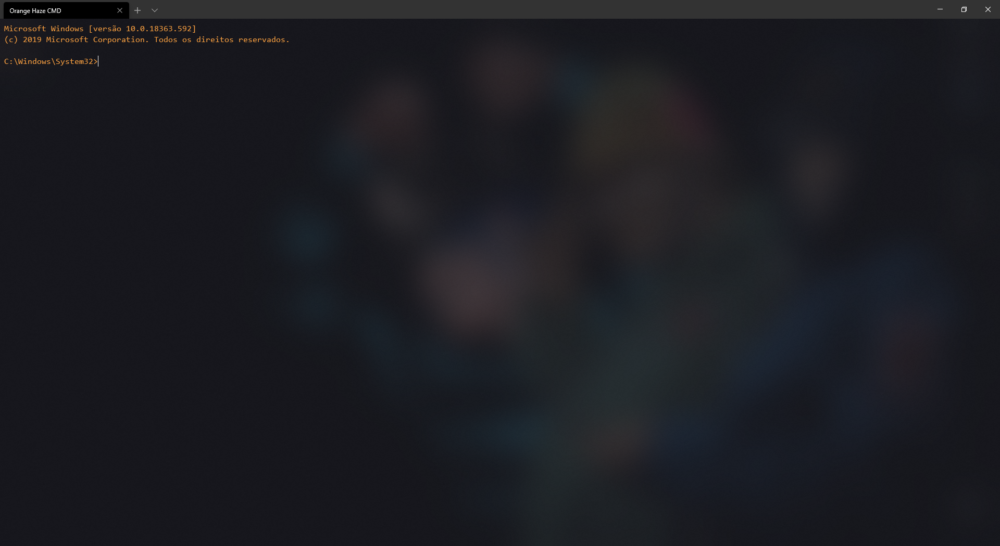

# Orange Haze for Windows Terminal
Dark theme for Windows Terminal.

<p align="center">
  
</p>

# Running
### 1. Download
````
# Download
Download 'profile.json' file.
````

### 2. Run
````json
// Change profile.json settings file for Windows Terminal, to downloaded profile.json or find the defaultProfile section and change value to:
"defaultProfile": "{9ed62add-2cb9-4be5-a444-72d56b888d7f}"

// On profiles section add:
{
    "guid": "{9ed62add-2cb9-4be5-a444-72d56b888d7f}",
    "colorScheme": "orange-haze",
    "name": "Orange Haze CMD",
    "commandline": "powershell.exe",
    "useAcrylic": true,
    "acrylicOpacity": 0.7
}

// On schemes section add:
{
    "name": "orange-haze",
    "icon": "ms-appdata:///roaming/pwsh-32.png",
    "background": "#1a1b24",
    "foreground": "#F39C3F",
    "black": "#000000",
    "blue": "#0088dd",
    "cyan": "#069b7d",
    "green": "#00aa47",
    "purple": "#7813a3",
    "red": "#bf1607",
    "white": "#ffffff",
    "yellow": "#fcf535",
    "brightBlack": "#141313",
    "brightBlue": "#61b4e8",
    "brightCyan": "#0cd3ab",
    "brightGreen": "#40d67e",
    "brightPurple": "#b200ff",
    "brightRed": "#f45c4e",
    "brightWhite": "#ffffff",
    "brightYellow": "#f2ef98"
}

````

# Authors
* [xxgicoxx](https://github.com/xxgicoxx)

# Acknowledgments
* [FlatIcon](https://www.flaticon.com/)